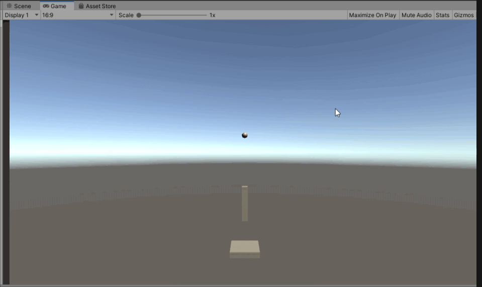
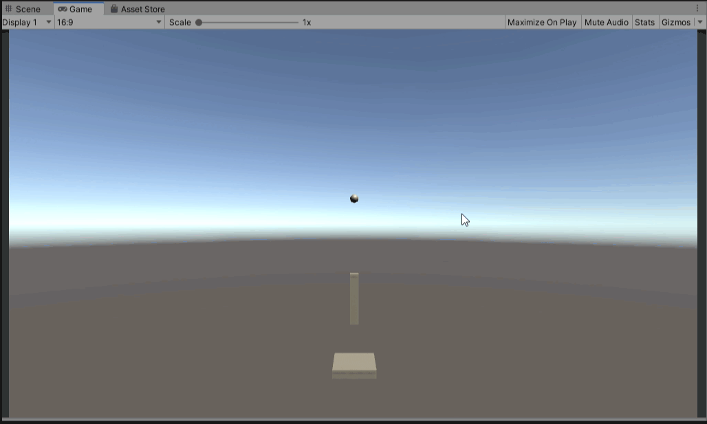
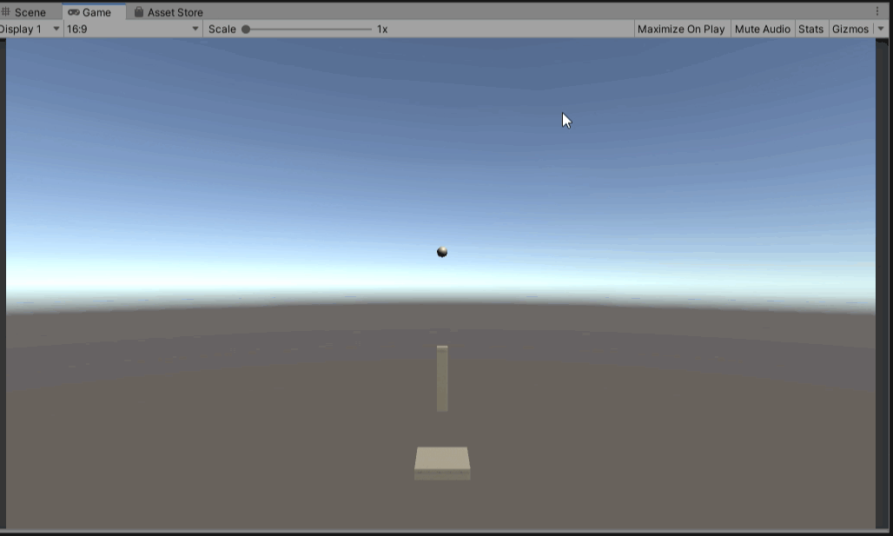

# SpringPushStick
バネの動きを確認するために作成したサンプルコードです。

以下の2パターンのコードを作成しました。

* 「Spring Joint」を使ったバネの動き
* 自作スクリプトでバネの動き

*****************************************************************

## 「Spring Joint」を使ったバネの動き
*****************************************************************

### 概要
シーン名：「BySpringJoint」

棒と床の間に「Spring Joint」を設定しており、マウスの距離に応じて棒に力がかかるようになっています。

### ハマったこと1
マウスの距離の分に応じて力をかけるにあたって、ばねからの反発力が棒の位置を安定させなかったため、マウスの距離からの力以外にばねにかかる力を打ち消すような力を加えるようにコードを書いていた。

ばねにかかる力はSpringJointコンポーネントの`currentForce`によってとれそうだったので、それを`AddForce()`で打ち消す方向に力かけていたが、、、下のように棒が大暴走した笑

結局、`currentForce`は使わず、マウスの移動距離を`AddForce()`でかけるのみにしたら安定した。

`currentForce`で取得できるのは実際にばねにかかっている力ではないのかも？？？

このときに書いたコードは以下に格納した。

[NG_CASE/ハマったこと1/NG1_StickController.cs](NG_CASE/ハマったこと1/NG1_StickController.cs)

### 参考

* [Spring Jointのマニュアル](https://docs.unity3d.com/ja/current/Manual/class-SpringJoint.html)
* [UnityのSpring Jointを使う](https://qiita.com/yanosen_jp/items/1642fb928a140146cf1b)

*****************************************************************

## 自作スクリプトでバネの動き
*****************************************************************

### 概要
シーン名：「ByScript」

バネはフックの法則によって、初期位置からの距離に比例したかかる力を計算しています。

「Spring Joint」と同じように、マウスの距離に応じて棒に力がかかるようになっています。

また、実際の世界では空気抵抗があるため、バネの振動が徐々に収まる動きとなりますが、空気抵抗がないとずっと振動し続けてしまいます。

そのため、Rigidbodyで空気抵抗Dragを使って、バネの振動が収まるようにしています。

### 参考

* [フックの法則とは？1分でわかる意味、公式、単位、応力、ヤング率の関係](http://kentiku-kouzou.jp/sp/zairiki-hukkunohousoku.html)
* [【Unity】バネの動きを実現する3つの方法](http://nn-hokuson.hatenablog.com/entry/2017/05/23/204718)
