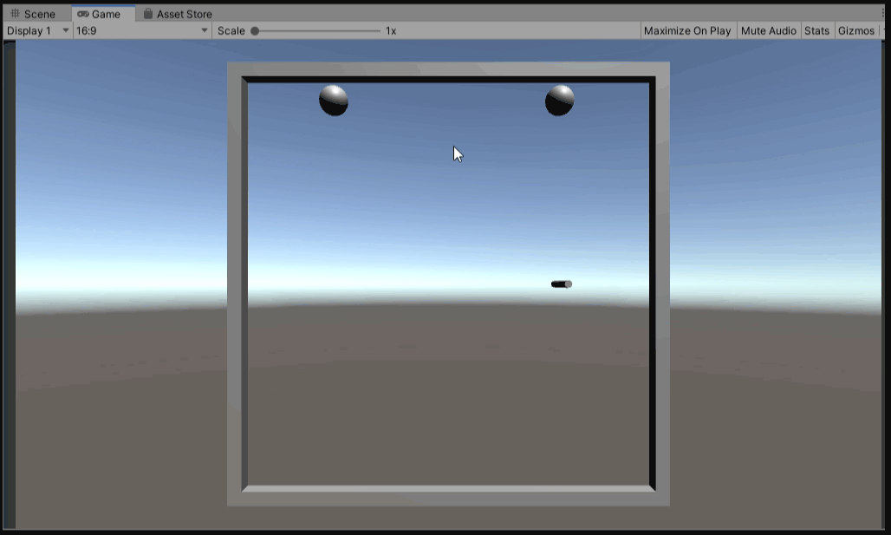
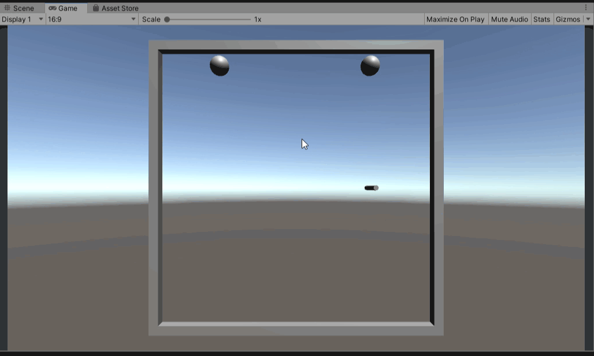

# RollBall
ビー玉の動きを確認するために作成したサンプルコードです。

以下の2パターンのコードを作成しました。

* 「Rigidbody」のみを使ったビー玉の動き
* 「Rigidbody」+「Physic Material」を使ったビー玉の動き

*****************************************************************

## 「Rigidbody」のみを使ったビー玉の動き
*****************************************************************

### 概要
シーン名：「RollBall-UnityLearn」

壁、玉、釘に「Rigidbody」を設定しており、重力や衝突の物理動作を行えるように設定しています。

上の動画のように、「Rigidbody」のみでは衝突時の跳ね返りが表現されず、玉の上に釘の上に乗ってしまったり、壁と衝突しても跳ね返らず壁に沿って転がってしまいます。

自分が作りたいのはビー玉と釘が衝突時の動作を表現したかったのですが、「Rigidbody」のみでは厳しそうだということが分かりました。

### 使い方
1. study_unity/02_RollBallをご自分の環境に読み込ませてください。
2. シーン名：「RollBall-UnityLearn」を開いてください。

### 参考

* [【Unity 入門】【チュートリアル】玉転がしゲームを作る](https://baba-s.hatenablog.com/entry/roll-ball-tutorial)
* [玉転がし](https://learn.unity.com/project/yu-zhuan-gashi?language=ja)

*****************************************************************

## 「Rigidbody」+「Physic Material」を使ったビー玉の動き
*****************************************************************

### 概要
シーン名：「RollBall-PhysicMaterial」

「Rigidbody」のみではビー玉と釘が衝突時の跳ね返りが表現されないことが分かったので、「Physic Material」を使って、跳ね返りを表現できるようにしました。

「Physic Material」はオブジェクト間の跳ね返りや摩擦を表現できるようです。

壁、玉、釘のオブジェクトに「Physic Material」を設定しました。

上の動画のように、「Rigidbody」に「Physic Material」を追加することでオブジェクトの跳ね返りが表現できました。

パラメータをいじればビー玉と釘の間の跳ね返りを表現できそうです。

### 使い方
1. study_unity/02_RollBallをご自分の環境に読み込ませてください。
2. シーン名：「RollBall-PhysicMaterial」を開いてください。

### 参考

* [【Unity】ブロック崩し(3D)の制作手順を解説！反射角度・速度調整・クリア判定まで](https://xr-hub.com/archives/13513)
* [【Unity】物理特性マテリアルを用いた摩擦表現の方法](https://xr-hub.com/archives/13513)

