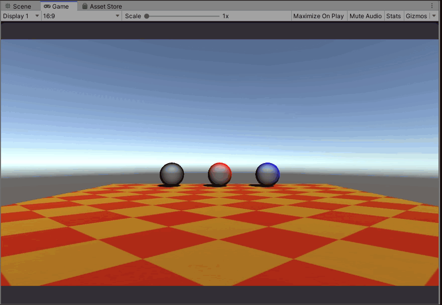
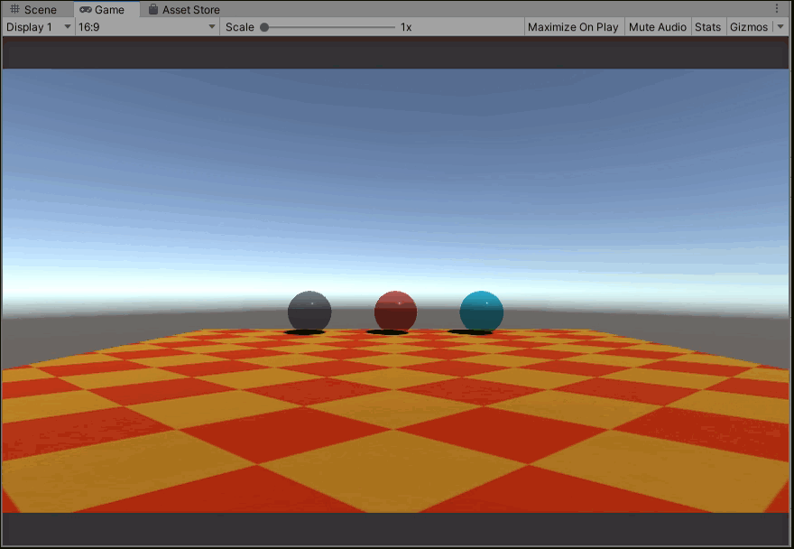
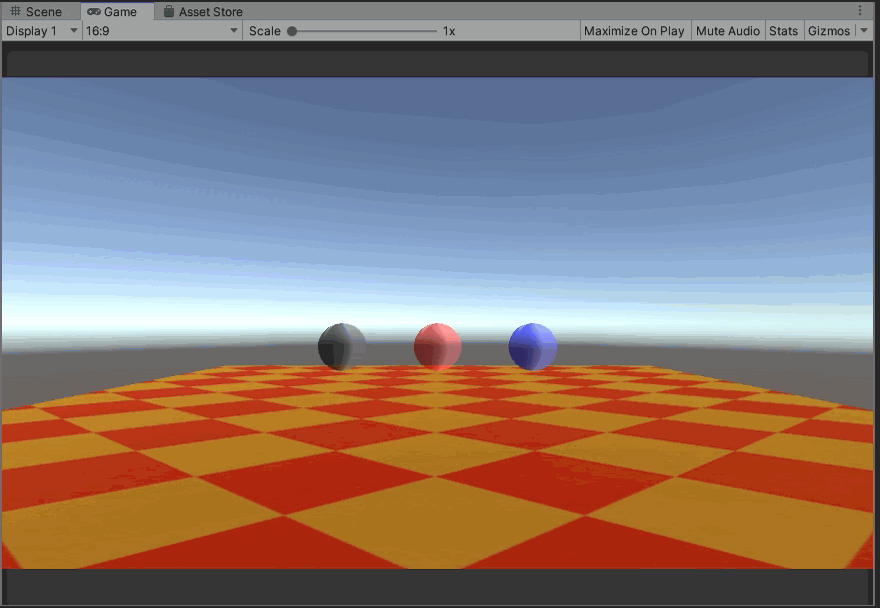

# MarbleDesign
ビー玉のデザインを検討するために作成したサンプルコードです。

以下のサイトを参考に3つのパターンのコードを作成しました。

* [おもちゃラボさんのシェーダー](http://nn-hokuson.hatenablog.com/entry/2016/10/07/221724)
* [Tsumiki Tech Timesさんのシェーダー](http://tsumikiseisaku.com/blog/shader-tutorial-glass/)
* [MK Glass Free](https://assetstore.unity.com/packages/vfx/shaders/mk-glass-free-100712)

*****************************************************************

## おもちゃラボさんのシェーダーのデザインを確認
*****************************************************************

### 概要
シーン名：「OmotyaLab」

表面の色(`o.Albedo`)　を変更することで黒、赤、青のビー玉を表現しています。

いろいろ設定すればもっと良くなるとは思うのですが、色が薄い気がします。

### 使い方
1. study_unity/03_MarbleDesignをご自分の環境に読み込ませてください。
2. シーン名：「OmotyaLab」を開いてください。

### 参考

* [【Unityシェーダ入門】氷のような半透明シェーダを作る](http://nn-hokuson.hatenablog.com/entry/2016/10/07/221724)

*****************************************************************

## Tsumiki Tech Timesさんのシェーダーのデザインを確認
*****************************************************************

### 概要
シーン名：「TsumikiTechTimes」

Tsumiki Tech Timesさんのシェーダーの_Colorで色を変えることができたので、ビー玉にタグをつけてタグごとにビー玉の色を変えるようにしました。

半透明感が良くできており、いい感じにビー玉っぽく見えます！

### 使い方
1. study_unity/03_MarbleDesignをご自分の環境に読み込ませてください。
2. シーン名：「TsumikiTechTimes」を開いてください。

### 参考

* [Unityシェーダーチュートリアルガラスの表現手法いろいろ](http://tsumikiseisaku.com/blog/shader-tutorial-glass/)

*****************************************************************

## MK Glass Freeのデザインを確認
*****************************************************************

### 概要
シーン名：「MkGlassFree」

MK Glass Freeさんのシェーダーを黒、赤、青ビー玉用のマテリアルに紐づけて、Inspectorから色を変更しました。

反射までしていて、よりガラス感を表現できそうです！

### 使い方
1. study_unity/03_MarbleDesignをご自分の環境に読み込ませてください。
2. シーン名：「MkGlassFree」を開いてください。
3. Unity Asset Storeで「[MkGlassFree](https://assetstore.unity.com/packages/vfx/shaders/mk-glass-free-100712)」をインストールしてください。
4. Assets/03_MkGlassFree/MarbleDesign03配下にあるマテリアルに「MkGlassFree」を設定します。

### 参考

* [MK Glass Free](https://assetstore.unity.com/packages/vfx/shaders/mk-glass-free-100712)

