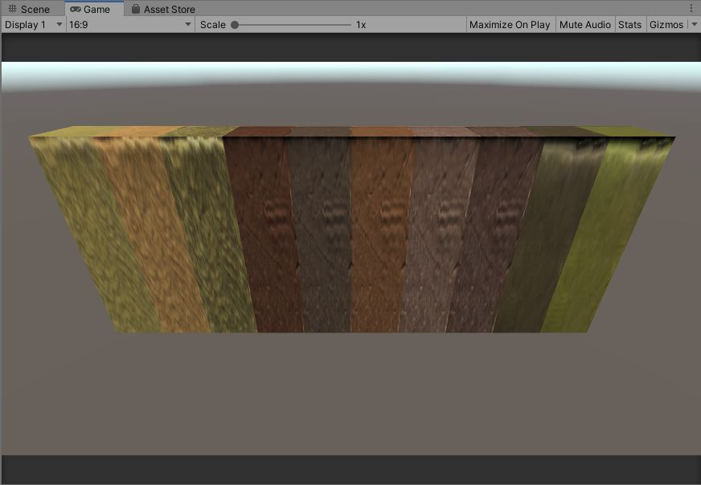
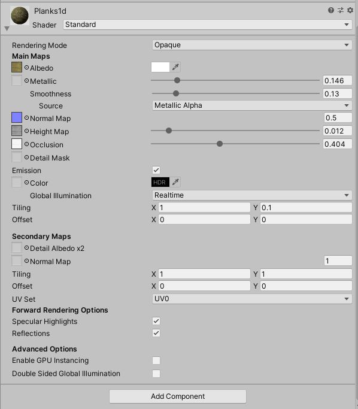
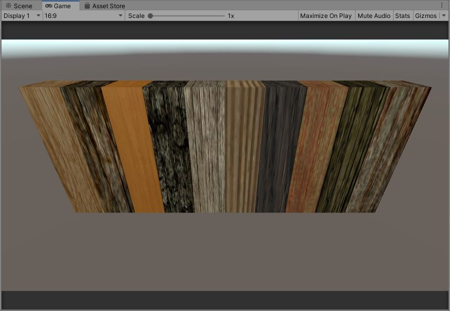
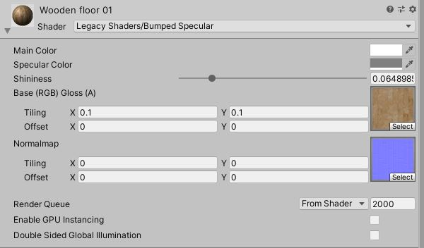
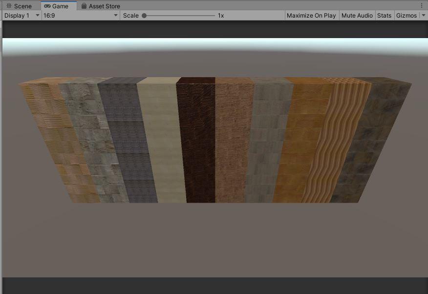
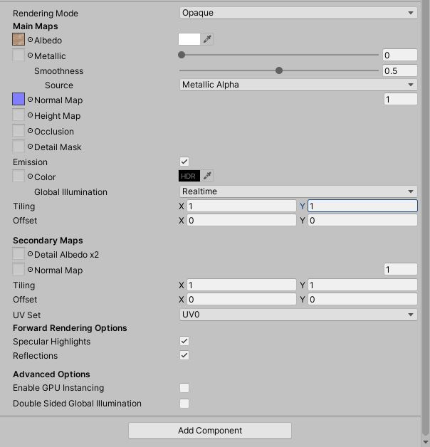

# WoodenDesign
木目のデザインを使いたいと考え、unity Asset Storeで木目調のテクスチャを調べました。

以下の2つのアセットを試しに使ってみてデザインを確認してみました。

* [Plank Textures PBR](https://assetstore.unity.com/packages/2d/textures-materials/wood/plank-textures-pbr-72318)
* [Yughues Free Wooden Floor Materials](https://assetstore.unity.com/packages/2d/textures-materials/wood/yughues-free-wooden-floor-materials-13213)
* [15 Original Wood Texture](https://assetstore.unity.com/packages/2d/textures-materials/wood/15-original-wood-texture-71286)

*****************************************************************

## 「Plank Textures PBR」を使ってみる
*****************************************************************

### 概要
シーン名：「01_PlankTexturesPBR」

「Plank Textures PBR」を使って木目調を出してみました。

上の図のマテリアルは左から以下のように並べています。

1. Planks1a
2. Planks1c
3. Planks1c
4. Planks4a
5. Planks4b
6. Planks4c
7. Planks4d
8. Planks4e
9. Planks5a
10. Planks5b

使い方が悪いのか、単一の木材にするためにテクスチャを拡大？しているみたいでかなりぼやけた表現となってしまいました。

### 使い方
1. study_unity/05_WoodenDesignをご自分の環境に読み込ませてください。
2. シーン名：「01_PlankTexturesPBR」を開いてください。
3. Unity Asset Storeで「[Plank Textures PBR](https://assetstore.unity.com/packages/2d/textures-materials/wood/plank-textures-pbr-72318)」をインストールしてください。
4. 上の画像のように表示するには、「[Plank Textures PBR](https://assetstore.unity.com/packages/2d/textures-materials/wood/plank-textures-pbr-72318)」に以下の設定ようにMain MapsのTillingの(X,Y)を(1,0.1)に設定してください。

### 参考

* [Plank Textures PBR](https://assetstore.unity.com/packages/2d/textures-materials/wood/plank-textures-pbr-72318)

*****************************************************************

## 「Yughues Free Wooden Floor Materials」を使ってみる
*****************************************************************

### 概要
シーン名：「02_YughuesFreeWoodenFloorMaterials」

「Yughues Free Wooden Floor Materials」を使って木目調を出してみました。

上の図のマテリアルは左から以下のように並べています。

1. Wooden floor 01
2. Wooden floor 02
3. Wooden floor 03
4. Wooden floor 04
5. Wooden floor 05
6. Wooden floor 06
7. Wooden floor 07
8. Wooden floor 08
9. Wooden floor 09
10. Wooden floor 10

いい感じに木材を表現できているのではないでしょうか。

### 使い方
1. study_unity/05_WoodenDesignをご自分の環境に読み込ませてください。
2. シーン名：「02_YughuesFreeWoodenFloorMaterials」を開いてください。
3. Unity Asset Storeで「[Yughues Free Wooden Floor Materials](https://assetstore.unity.com/packages/2d/textures-materials/wood/yughues-free-wooden-floor-materials-13213)」をインストールしてください。
4. 上の画像のように表示するには、「[Yughues Free Wooden Floor Materials](https://assetstore.unity.com/packages/2d/textures-materials/wood/yughues-free-wooden-floor-materials-13213)」に以下の設定ようにBase(RGB) Gloss(A)のTillingの(X,Y)を(0.1,0.1)にNormalmapのTillingの(X,Y)を(0,0)に設定してください。

### 参考

* [Yughues Free Wooden Floor Materials](https://assetstore.unity.com/packages/2d/textures-materials/wood/yughues-free-wooden-floor-materials-13213)

*****************************************************************

## 「15 Original Wood Texture」を使ってみる
*****************************************************************

### 概要
シーン名：「03_15OriginalWoodTexture」

「15 Original Wood Texture」を使って木目調を出してみました。

上の図のマテリアルは左から以下のように並べています。

1. Wood Texture 01
2. Wood Texture 03
3. Wood Texture 04
4. Wood Texture 05
5. Wood Texture 06
6. Wood Texture 07
7. Wood Texture 11
8. Wood Texture 13
9. Wood Texture 14
10. Wood Texture 15

いい感じに木材を表現できているのではないでしょうか。

### 使い方
1. study_unity/05_WoodenDesignをご自分の環境に読み込ませてください。
2. シーン名：「03_15OriginalWoodTexture」を開いてください。
3. Unity Asset Storeで「[Plank Textures PBR](https://assetstore.unity.com/packages/2d/textures-materials/wood/plank-textures-pbr-72318)」をインストールしてください。
4. 上の画像のように表示するには、「[15 Original Wood Texture](https://assetstore.unity.com/packages/2d/textures-materials/wood/15-original-wood-texture-71286)」に以下の設定ように設定してください。

※デフォルト設定から変更していないです。

### 参考

* [15 Original Wood Texture](https://assetstore.unity.com/packages/2d/textures-materials/wood/15-original-wood-texture-71286)

